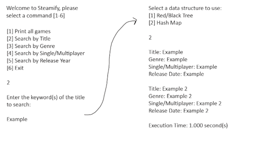

# <b>Steamify</b>

## <u>Team Members:</u>
- Albert Ramirez
- Deep Patel
- Matthew Wirnowski

## <u>Description</u>
Our project seeks to solve the issue of needing help finding a video game to play on the PC digital distribution platform Steam. We created a program that allows users to view or search for specific games that are available on the platform.

Users can search their favorite game by the title and get information about it. They are also able to search for games of a specific genre, category, or release year, which will help them determine whether or not they’re interested in it by searching more about it. In doing so, users are able to have a better idea of what games they should be looking to play and might even find the exact type of game they want to play.

## <u>Data Retrieval</u> - <i><small>Matthew</small></i>

The data we used is from Steam’s public API which has all current and upcoming games. The link to the dataset is here:
 
http://api.steampowered.com/ISteamApps/GetAppList/v0002/?key=STEAMKEY&format=json
 
This gave us the game ID and title. We then used the game’s ID to find more information about it. We collected the title, genre, if it’s singleplayer or multiplayer, and the release date. The link to the game information is here: 
 
http://store.steampowered.com/api/appdetails?appids={INSERT_APP_ID}

A python script was written that called the API in batches to fetch the data. For each game's AppID that was retrieved, a second API was called to fetch the specific game data. This data was cleaned and formatted to include the game's title, genre, game-mode, and release date. Finally, each game was written to a csv that was used as our organized data set. After running the script, we successfullly acquired over 74,000 steam games from their API.

## <u>Main App</u>
To store the data in our application, we used 2 data strucutres: a Red/Black tree and a Hash map. 

#### Red/Black Tree - <i>Albert</i>

For the R/B Tree, each node has the game title and the information about it. It will rebalance when there are 3 conditions not met: the root must be black, a red node always has black children, and the number of black nodes from the root to leaf is the same for every path. The balancing is done based on if the uncle is red or black and will either do a color flip or rotation. 

#### Hash Map - <i>Deep</i>

For the hash map, the key is the game title and the value is the game information. The hash map uses the djb2 hash function, then a reduction function to help shrink the index. To handle the collisions, we use separate chaining, which means an additional data structure is being used, a linked list. The starting size for the hash table is 50 and the load factor is 0.8. The size is doubled once the load factor is hit and there will be a rehash of the whole table. We test the efficiency by using time of searching for specific options, which are to print all games and search by title, genre, single/multi, and release year.

#### Interface - <i>Matthew</i>

We aimed to create a very simple and straightforward console-based user interface. Here is a sketch of the layout and how a series of commands look. We used a number-entry system for each selection option.

The user has the choice of the type of search to perform, as well as
the data structure to use. We provide the execution time after each search so that the user has the ability to compare the performance of each data strucutre.
